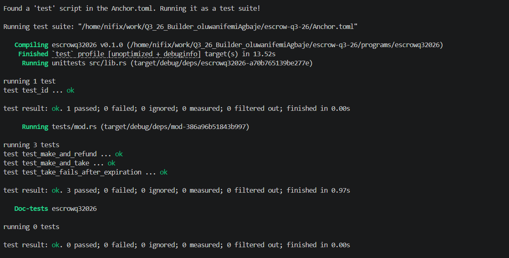

# Anchor Escrow Program

A token-swap escrow program built with [Anchor](https://www.anchor-lang.com/) on Solana. A **maker** deposits Token A into a vault and specifies how much Token B they want in return. A **taker** can fulfill the trade by paying the requested amount of Token B, at which point they receive the vaulted Token A. The maker can also cancel and reclaim their deposit at any time before it's taken. Escrows additionally support an **expiration timestamp**, after which they can no longer be taken.

## How It Works

The program exposes three instructions:

### `make`
The maker creates an escrow and deposits Token A into a vault owned by the escrow PDA.

- Derives an `Escrow` PDA from `["escrow", maker, seed]`, allowing one maker to run multiple concurrent escrows (differentiated by `seed`).
- Creates a vault (an associated token account for Token A) owned by the escrow PDA.
- Transfers the maker's deposit from their wallet into the vault.
- Stores the trade terms on the escrow account: `mint_a`, `mint_b`, `receive` amount, and `expiration`.

### `take`
A taker fulfills the trade.

- Rejects the instruction if `escrow.expiration` has already passed.
- Transfers the requested amount of Token B from the taker to the maker.
- Transfers the vaulted Token A from the vault to the taker.
- Closes the vault and the escrow account, refunding their rent to the maker.

### `refund`
The maker cancels an open escrow and reclaims their deposit.

- Verifies (via `has_one` constraints and PDA seeds) that the signer is the original maker.
- Transfers the vault's balance back to the maker.
- Closes the vault and the escrow account, refunding their rent to the maker.

## Program Structure

```
programs/escrowq32026/
├── src/
│   ├── instructions/
│   │   ├── make.rs      # Open an escrow and deposit Token A
│   │   ├── take.rs      # Fulfill an escrow
│   │   └── refund.rs    # Cancel an escrow and reclaim the deposit
│   ├── state.rs         # Escrow account definition
│   ├── constants.rs     # PDA seeds and other shared constants
│   ├── error.rs         # Custom error codes (e.g. EscrowExpired)
│   └── lib.rs           # Instruction entrypoints
└── tests/
    └── mod.rs           # LiteSVM integration tests
```

## Testing

Tests are written with [LiteSVM](https://github.com/LiteSVM/litesvm), which runs a full Solana runtime in-process for fast, dependency-free integration testing (no local validator required).

Covered scenarios:

- **`test_make_and_refund`** — maker opens an escrow, then cancels it and reclaims their deposit.
- **`test_make_and_take`** — maker opens an escrow; taker pays Token B and receives the vaulted Token A; escrow and vault are closed.
- **`test_take_fails_after_expiration`** — the escrow's clock is fast-forwarded past its expiration using LiteSVM's sysvar manipulation (`get_sysvar::<Clock>()` / `set_sysvar::<Clock>(&clock)`), and `take` is asserted to fail.

Run the test suite with:

```bash
cargo test
```

or, if using the Anchor CLI:

```bash
anchor test
```

### Tests Passing

All 4 tests pass — 1 unit test plus the 3 LiteSVM integration tests:

```
running 1 test
test test_id ... ok

test result: ok. 1 passed; 0 failed; 0 ignored; 0 measured; 0 filtered out; finished in 0.00s

     Running tests/mod.rs (target/debug/deps/mod-386a96b51843b997)

running 3 tests
test test_make_and_refund ... ok
test test_make_and_take ... ok
test test_take_fails_after_expiration ... ok

test result: ok. 3 passed; 0 failed; 0 ignored; 0 measured; 0 filtered out; finished in 0.97s
```



## Key Design Notes

- All token operations use `transfer_checked`, which validates the mint and decimals on every transfer — safer than a plain `transfer` for interop with Token-2022 mints.
- The escrow PDA signs on its own behalf for vault transfers and closures via seed-derived signer seeds (`CpiContext::new_with_signer`).
- `maker` in the `Take` accounts struct must be marked `#[account(mut)]` — both the escrow's `close = maker` constraint and the vault's `close_account` CPI send lamports to it, so it needs to be writable at the top level or the CPI fails with a privilege-escalation error.
- `taker_ata_a` and `maker_ata_b` use `init_if_needed` since neither party is required to already hold a token account for the other's mint; `taker_ata_b` does not, since the taker must already hold Token B to pay with.

## Prerequisites

- [Rust](https://www.rust-lang.org/tools/install)
- [Solana CLI](https://docs.solanalabs.com/cli/install)
- [Anchor CLI](https://www.anchor-lang.com/docs/installation)

## Building

```bash
anchor build
```